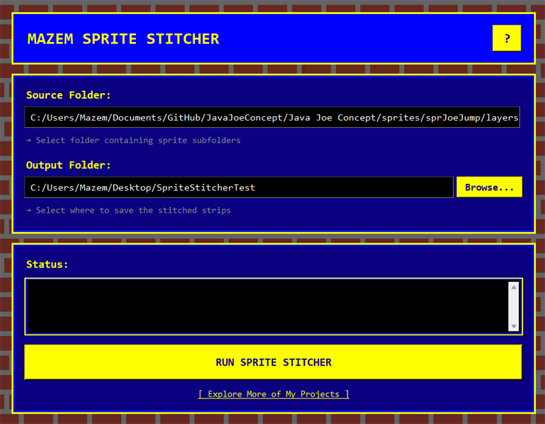

# Mazem Sprite Stitcher - GMS2 Strip Generator

A retro-themed GUI tool for GameMaker Studio 2 that converts individual sprite frames into horizontal sprite strips in seconds.



## Features

✨ **Easy-to-use GUI** with retro 90s aesthetic matching [Mazem Games](https://mazemgames.neocities.org/)
- Built-in help documentation

🔧 **Smart Sprite Processing**
- Automatically processes all sprite subfolders in a directory
- Natural numeric sorting
- Creates sprite strips with frame count in filename (e.g., `boss_strip8.png`)

💾 **Persistent Settings**
- Remembers your last source and output folders
- Saves configuration automatically between sessions

🌐 **Interactive Elements**
- Help button with detailed usage instructions
- Direct link to explore more projects
- Real-time status updates during processing

## Installation

### Option 1: Run from Source (Requires Python)

If you prefer to run the program from source without using the standalone exe, download the **Source code (zip)** from the Releases page and extract it locally (do not clone the repository unless you plan to contribute).

1. Download and extract the source zip from the Releases page.

2. Install Python dependencies:
   ```bash
   pip install Pillow
   ```

3. Run the application from the extracted folder:
   ```bash
   python stitch_sprites.py
   ```

### Option 2: Standalone Executable (Windows)

1. Download the latest release from [Releases](https://github.com/DEMaze03/GMS2_Strip_Generator/releases)
2. Extract the ZIP file to any location
3. Double-click `SpriteStitcher.exe` to launch

## Building a Windows exe (for maintainers)

If you want to build the standalone exe yourself, install PyInstaller and run from the project root:

```bash
pip install pyinstaller
pyinstaller --onefile --windowed --name "SpriteStitcher" --add-data "assets;assets" stitch_sprites.py
```

Notes:
- On Windows use `--add-data "assets;assets"` to ensure the `assets/` folder (background image, etc.) is bundled.
- For a custom icon provide a `.ico` file and add `--icon myicon.ico` to the command.
   - No Python installation required
   - No dependencies to install
   - Everything is bundled together

## How to Use

### Step 1: Select Source Folder
Click **"Browse..."** next to "Source Folder" and select a folder containing sprite subfolders.

**Expected folder structure:**
```
YourSpritesFolder/
├── character_idle/
│   ├── frame_1.png
│   ├── frame_2.png
│   └── frame_3.png
├── character_walk/
│   ├── 01.png
│   ├── 02.png
│   └── 03.png
└── character_jump/
    ├── jump1.png
    ├── jump2.png
    └── jump3.png
```

### Step 2: Select Output Folder
Click **"Browse..."** next to "Output Folder" and choose where to save the stitched sprite strips. The folder will be created if it doesn't exist.

### Step 3: Run
Click **"RUN SPRITE STITCHER"** and watch the status panel for real-time updates.

**Output example:**
```
Created character_idle_strip3.png
Created character_walk_strip3.png
Created character_jump_strip3.png
```

### Results
All sprite strips are saved as PNG files with transparency (RGBA format) and can be immediately imported into GameMaker Studio 2.

## Features Explained

### Natural Frame Sorting
Frames are sorted intelligently, so numbering like `frame_2.png` and `frame_10.png` are ordered correctly (not alphabetically).

### Automatic Subfolder Processing
Every subfolder in your source directory becomes a separate sprite strip. Empty folders are skipped automatically.

### Consistent Frame Sizes
All frames within a single sprite must be the same dimensions. The tool assumes this for horizontal stitching.

## Configuration

Settings are automatically saved to:
- **Windows**: `C:\Users\[YourUsername]\.sprite_stitcher_config.json`
- **macOS/Linux**: `~/.sprite_stitcher_config.json`

Folders are only restored if they still exist on your system.

## Troubleshooting

**❌ "Please select a source folder"**
- Solution: Click Browse and choose a valid folder containing sprite subfolders

**❌ No sprite strips were created**
- Check that your source folder contains subfolders (not just PNG files in the root)
- Verify all PNG files in each subfolder have the same dimensions
- Ensure filenames contain PNG files only

**❌ Text appears fuzzy**
- This is a system-level tkinter rendering limitation
- Try adjusting your display scaling or font size in your OS settings

**❌ "Could not load background image"**
- Ensure `assets/brickwall.png` exists in the same directory as the script
- The application will still work using a fallback brown color

## Project Structure

```
GMS2_Strip_Generator/
├── stitch_sprites.py          # Main application
├── assets/
│   └── brickwall.png          # Background image
├── README.md                  # This file
└── requirements.txt           # Python dependencies
```

## Requirements

### For Running from Source
- Python 3.6+
- Pillow (PIL) library

### For Standalone Executable
- Windows 7 or later
- No additional software required

## About

Created by [Daylon Maze](https://mazemgames.neocities.org/) for GameMaker developers who need quick sprite strip generation.

## License

This project is open source and available under the MIT License.

## Contributing

Found a bug or have a suggestion? Feel free to open an issue or submit a pull request!

## Changelog

### v1.0.0
- Initial release
- GUI interface with retro theming
- Automatic folder detection and processing
- Persistent settings storage
- Help documentation
- Projects page link

---

**Questions?** Check the built-in help (? button).
